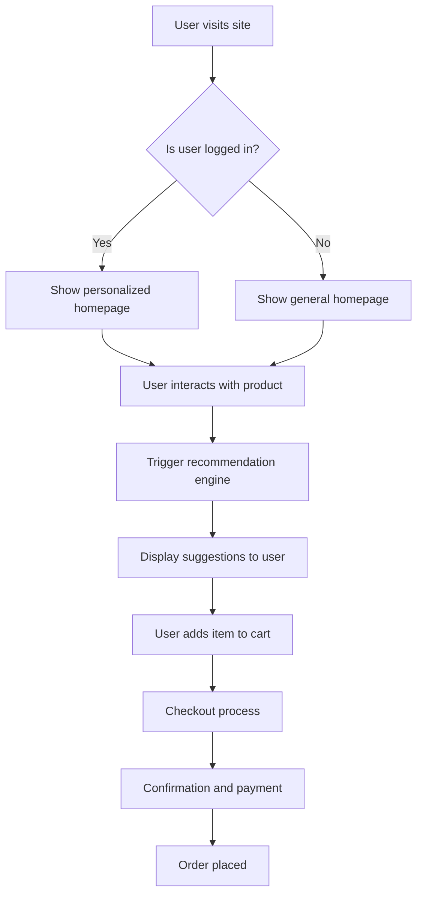

# 🛍️ EchoMart: Where Every Click Matters

EchoMart is an innovative e-commerce platform that redefines online shopping with **machine learning-powered recommendations**, **intuitive design**, and **24/7 chatbot support**. Built to deliver a seamless and intelligent user experience, EchoMart is the one-stop platform for modern digital shopping.

---

## 🚀 Features

### 🛒 Why EchoMart?
- **🎯 Personalized Recommendations**  
  ML-based product suggestions tailored to user preferences.

- **⚡ Optimized Server-Side Computation**  
  Recommendations generated only when needed for better performance.

- **💬 24/7 Chatbot Support**  
  Get instant help anytime during your shopping journey.

- **🛠️ Admin Panel**  
  Easily manage your products with add, edit, and delete options.

- **👌 User-Friendly Interface**  
  Clean and intuitive UI for a smooth browsing experience.

---

## 🔍 Recommendation Strategies

1. **Content-Based Filtering**  
   Recommends products with similar names to those the user interacted with.

2. **Collaborative Filtering**  
   Recommends based on preferences and actions of similar users.

3. **Hybrid Recommendation System**  
   Combines both content-based and collaborative filtering for smarter suggestions.

---

## 💻 Tech Stack

- **Frontend**: Angular, Bootstrap  
- **Backend**: Flask  
- **Database**: SQLite

---

## 📂 Project Structure

```
/echomart
├── static/               # Static files (CSS, JS, images)
├── templates/            # HTML templates (index.html, main.html, etc.)
├── app.py                # Main Flask application
├── util.py               # Recommendation utility functions
├── models/               # Database models
├── Angular-frontend/     # Angular frontend files
└── README.md             # Project documentation
```

---

## 🧭 System Flow



---

## 🛠️ Installation

### ✅ Prerequisites

- Python 3.8+
- Node.js & Angular CLI

### ⚙️ Setup

1. **Clone the repository**  
   ```bash
   git clone https://github.com/kshitij7704/E_Commerce_Recommendation_System
   cd echomart
   ```

2. **Set up the backend**
   ```bash
   pip install -r requirements.txt
   python app.py
   ```

3. **Set up the frontend**
   ```bash
   cd Angular-Frontend
   npm install
   ng serve
   ```

4. **Access the application**
   - Backend: [http://localhost:5000](http://localhost:5000)  
   - Frontend: [http://localhost:4200](http://localhost:4200)

---

## 🤝 Contributing

Contributions are welcome!  
To contribute:

1. Fork the repository  
2. Create a new branch  
   ```bash
   git checkout -b feature-branch
   ```
3. Make your changes  
4. Commit your changes  
   ```bash
   git commit -m "Add some feature"
   ```
5. Push to GitHub  
   ```bash
   git push origin feature-branch
   ```
6. Open a pull request

---

## 📩 Issues & Feedback

Have suggestions or facing issues?  
Feel free to [open an issue](https://github.com/kshitij7704/E_Commerce_Recommendation_System/issues) in the repository.

---

**Happy Shopping with EchoMart!**
